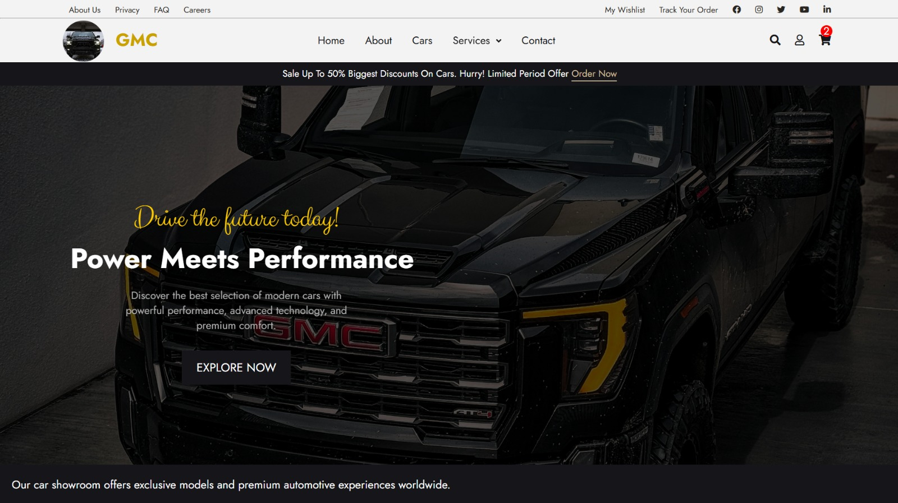
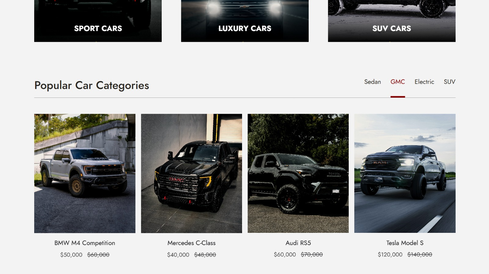

# Car E-Commerce Website

A responsive car e-commerce website built using HTML and CSS.

The website presents a modern car showroom interface with different car categories, featured cars, customer testimonials, latest news, and service sections.

## Features

- Responsive car showroom layout
- Navigation bar with dropdown menu
- Login and user interface design
- Car categories section
- Featured cars with prices and discounts
- Shopping cart, wishlist, and search icons
- Customer testimonials section
- Latest automotive news section
- Newsletter subscription area
- Services and support section
- Font Awesome icons
- Google Fonts integration

## Technologies Used

- HTML5
- CSS3
- Font Awesome
- Google Fonts

## Screenshots

## Project Purpose

This project was developed to practice Front-End Development concepts, including:

- HTML page structure
- CSS styling
- Flexbox layouts
- Responsive design
- Navigation menus
- Image positioning
- Hover effects
- Website sections organization
- User interface design
